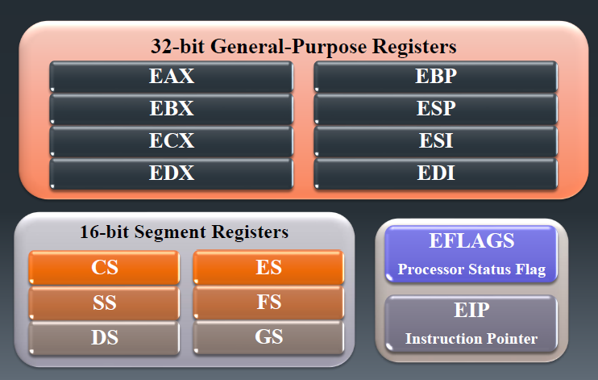

# Assembly Notes
## Lecture 1

### Basic Computer Architecture :
 

- CPU consists of 	
  - ALU "Arithmetic Logic Unit" performs arithmetic and bitwise operations
  - CU "Control Unit" cooridnates sequence of execution steps
  - Clock and registers.
- Bus 
  - is a group of parallel wires that transfer data from one part of the computer to another.
- Notes 
  - Accessing data in registers is much faster than memory
  - CPU include several registers that store current instruction and its operands to allow ALU performs the required operation.
  - An instruction requires at least one clock cycle to execute, and a few require of 50 clocks 
  - To synchronize operations inside CPU, an internal clock is continuously pulsing to trigger events
  - Running programs reside in memory and they're executed instruction by instruction
  - To execute an instruction, it should be transferred to the CPU registers and follow the instruction execution cycle.

### Instruction Execution Cycle :
 

### Registers :
 

- General Purpose Registers
  - EAX : accumulator
  - ECX : loop counter
  - ESP : stack pointer
  - ESI : source index
  - EDI : destination index 
  - EBP : extended base pointer (stack) 
- Segment Registers
  - CS : code segment
  - DS : data segment
  - SS : stack segment
  - ES, FS, GS : additional segments.
- EIP
  - Extended Instruction Pointer
  - keeps track of the next instruction to be executed.
- EFLAGS
  - Carry Flag : unsigned arithmetic out of range
  - Overflow Falg : signed arithmetic out of range
  - Sign Flag : result is negative
  - Zero Flag : result is zero
  - Parity Flag : sum of 1 bits is an even number
  - Auxiliary Flag :
	- is 1 when carry from bit 3 to bit 4 is 1 "in addition"
	- is 1 when carry from bit 3 to bit 4 is 0 "in subtraction"

### Accessing parts of registers :


### Memory Addressing Modes :
- Real Address Mode 
  - allows direct access to memory and hardware 
  - is not a secure mode
  - used in early processor version (16 bit)	
  - 20-bit address -> Max memory space 1 MB.
- Protected Mode "default" 
  - is a secure mode
  - Program is sperated to the memory segments
  - 32-bit address -> Max memory space 4 GB.
- Virtual 8086 Mode 
  - Runs real mode within protected mode for backward compatibility.

### Calculating Physical Addresses :
``` Example :- convert 08F1:0100 to a linear "physical" address ```
- Steps :
   1. multiply segment address by 16 (add a hexadecimal zero)
   2. add the result to the offset. <br>

			
